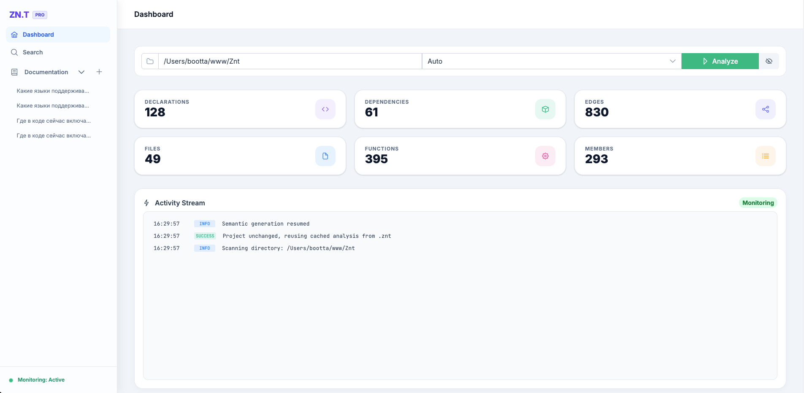

# Znt — Intelligent Code Graph & RAG Documentation

Инструмент для интеллектуального анализа структуры кода, построения графов зависимостей (наследование, вызовы методов, вложенность) и генерации RAG-документации по проекту на базе LLM.



---

## Запуск приложения

Сборка дистрибутива содержит скомпилированные бинарные файлы для различных платформ (macOS ARM64/Intel, Linux ARM64/AMD64) и Docker-окружение.

Для запуска используйте поставляемый `Makefile` в папке с дистрибутивом.

### Способ 1: Запуск локального бинарного файла
Команда автоматически определяет операционную систему и архитектуру процессора, после чего запускает соответствующую версию приложения.

*   **Простой запуск:**
    ```bash
    make run
    ```
*   **Запуск с автоматическим сканированием проекта:**
    Передайте переменную `SRC` с абсолютным путем к анализируемому проекту:
    ```bash
    make run SRC=/absolute/path/to/project
    ```

### Способ 2: Запуск в Docker-контейнере
Позволяет запустить изолированное приложение без установки локальных зависимостей.

*   **Простой запуск:**
    ```bash
    make run-docker
    ```
*   **Запуск со сканированием проекта:**
    Передайте переменную `SRC` для автоматического монтирования директории проекта внутрь контейнера:
    ```bash
    make run-docker SRC=/absolute/path/to/project
    ```

После успешного запуска веб-интерфейс (панель управления) будет доступна по адресу:  
👉 **[http://localhost:8080](http://localhost:8080)**

---

## Как пользоваться приложением

1.  **Сканирование (Scan)**:
    Если вы не передали путь при старте (`SRC=...`), вы можете указать путь к проекту прямо в веб-интерфейсе, выбрать основной язык программирования (или оставить `auto`) и нажать кнопку **Scan**. Начнется построение графа зависимостей и семантический анализ с использованием LLM.
2.  **Мониторинг изменений (Monitoring)**:
    Для отслеживания правок кода в реальном времени включите опцию **Watch**. Любые сохраненные изменения в кодовой базе автоматически обновят граф зависимостей и семантические данные в фоне.
3.  **Использование RAG-документации (Chat/Documentation)**:
    В веб-интерфейсе доступна вкладка чата. Вы можете задавать любые вопросы о логике работы проекта (например, *"Как работает авторизация?"* или *"Где создаются подключения к БД?"*). AI-агент извлечет наиболее релевантные узлы графа кода, сформирует контекст и предоставит развернутый ответ со ссылками на файлы.
4.  **Остановка приложения**:
    Чтобы остановить сервер, нажмите `Ctrl+C` в окне терминала, где запущен процесс (или контейнер).

---

## Интеграция с API

Вы можете использовать API Znt для интеграции со сторонними инструментами или собственными AI-агентами.

### 1. Получение списка поддерживаемых языков
*   **Метод**: `GET`
*   **Эндпоинт**: `/api/languages`
*   **Описание**: Возвращает список доступных парсеров и поддерживаемых расширений файлов.

### 2. Запуск сканирования проекта
*   **Метод**: `POST`
*   **Эндпоинт**: `/api/scan`
*   **Тело запроса (JSON)**:
    ```json
    {
      "path": "/absolute/path/to/project",
      "language": "auto"
    }
    ```
*   **Описание**: Запускает асинхронный процесс сканирования указанной директории. `language` может принимать значения: `auto`, `go`, `javascript`, `csharp`, `php`, `java`, `python`.

### 3. Управление мониторингом изменений
*   **Метод**: `POST`
*   **Эндпоинт**: `/api/monitor`
*   **Тело запроса (JSON)**:
    ```json
    {
      "path": "/absolute/path/to/project",
      "language": "auto",
      "enable": true
    }
    ```
*   **Описание**: Включает (`enable: true`) или выключает (`enable: false`) файловый наблюдатель (watcher) для оперативного обновления графа.

### 4. Семантический поиск по коду
*   **Метод**: `GET`
*   **Эндпоинт**: `/api/search?q=<запрос>`
*   **Пример**: `/api/search?q=database connection`
*   **Описание**: Возвращает список наиболее релевантных элементов кода (функции, классы, структуры) с их кратким описанием, тегами и степенью совпадения (score).

### 5. Получение RAG-документации по запросу
*   **Метод**: `POST` или `GET`
*   **Эндпоинт**: `/api/documentation`
*   **Тело запроса (для POST, JSON)**:
    ```json
    {
      "query": "Как работает инициализация сервера?",
      "history": [],
      "previously_used_nodes": []
    }
    ```
*   **Параметр (для GET)**: `/api/documentation?q=Как работает инициализация сервера?`
*   **Описание**: Возвращает ответ от языковой модели на основе контекста вашего кода. При наличии заголовка `Accept: text/event-stream` ответ будет передаваться по частям (streaming) через SSE.

### 6. Получение JSON-контекста для внешних AI-агентов
*   **Метод**: `GET`
*   **Эндпоинт**: `/api/context?q=<запрос>`
*   **Описание**: Извлекает подграф релевантных файлов и узлов, возвращая форматированный JSON-контекст, готовый для передачи в сторонние AI-агенты.

---

## Настройки конфигурации (config.yaml)

Все основные настройки приложения хранятся в файле `config.yaml` в директории запуска.

### Основные разделы конфигурации

#### `[llm]` — Настройки языковой модели
*   `provider`: Провайдер LLM (`ollama` или `openapi`).
*   `url`: Адрес API-сервера LLM (по умолчанию для Ollama: `http://localhost:11434`).
*   `token`: API-ключ (обязателен при выборе провайдера `openapi`).
*   `model`: Модель для анализа кода, извлечения метаданных и ответов на вопросы (например, `qwen2.5:7b` или `gpt-4o`).
*   `embed_model`: Векторная модель для построения эмбеддингов (например, `embeddinggemma` или `text-embedding-3-small`).
*   `batch_size`: Размер пакета для генерации эмбеддингов за один запрос (по умолчанию: `80`).
*   `request_timeout_minutes`: Тайм-аут одного запроса к LLM в минутах (по умолчанию: `20`).
*   `retry_delays_seconds`: Массив пауз в секундах перед повторной попыткой при ошибке сети (например, `[60, 120, 300]`).

#### `[runtime]` — Производительность и лимиты
*   `concurrency.semantic_workers`: Число параллельных потоков извлечения семантики (рекомендуется `1`–`3`).
*   `throttling.delay_ms`: Базовая задержка между запросами к LLM в миллисекундах (по умолчанию: `500`).
*   `throttling.adaptive`: Автоматическая регулировка задержек при высокой нагрузке на LLM (`true`/`false`).
*   `limits.max_file_size_kb`: Максимальный размер отдельного файла кода для обработки (по умолчанию: `200` KB).

#### `[documentation]` — Настройки ответов и контекста
*   `output_language`: Язык, на котором модель должна отвечать на вопросы (по умолчанию: `ru`).
*   `top_n`: Максимальное количество наиболее релевантных узлов кода, добавляемых в контекст модели (по умолчанию: `15`).
*   `branch_n`: Глубина обхода связанных ребер графа от каждого найденного узла (по умолчанию: `2`).
*   `max_iterations`: Лимит итераций поиска при сборе контекста (по умолчанию: `1`).
*   `max_context_tokens`: Предельный размер контекстного окна в токенах для отправки в модель (по умолчанию: `8000`).

#### `[exclude]` — Глобальные исключения
*   Массив масок путей, которые полностью игнорируются при сканировании и мониторинге (например, `dist/**`, `node_modules/**`, `vendor/**`).

#### `[languages]` — Языковые настройки
*   Специфические настройки масок файлов (`include`, `exclude`), точек входа (`entrypoints`) и директорий внешних зависимостей (`dependency_dirs`) для отдельных языков программирования.
